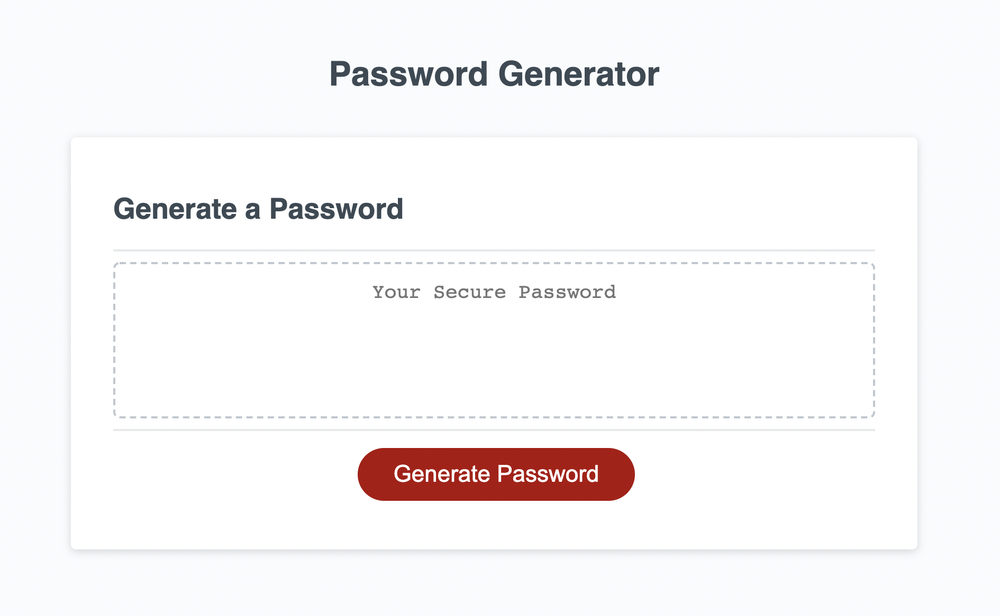

# Password Generator

## Objective
Randomly generate a password that meets certain criteria in order to create a strong password that provides greater security for employees with access to sensitive data.

## Acceptance Criteria
- Generate a new, secure password
- When the generate password button is clicked, 
a series of prompts for password criteria are presented to the user
- The length of the password should be at least 8 characters and no more than 128 characters
- User will be prompted to confirm whether or not to include lowercase, uppercase, numeric, and/or special characters
- Input should be validated and at least one character type should be selected
- When all prompts are answered a password is generated that matches the selected criteria
- When the password is generated then the password is either displayed in an alert or written to the page

### Layout

### Link
[Password Generator](https://lexslo.github.io/password-generator/)